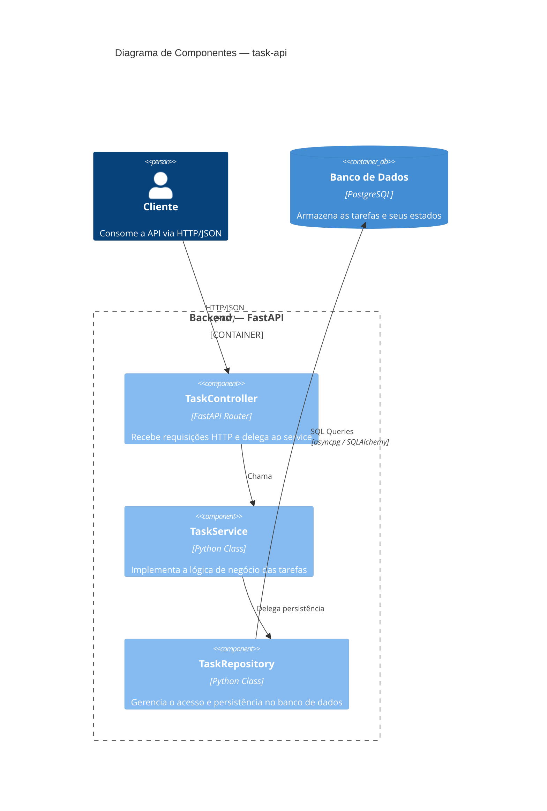

```mermaid
C4Component
    title Diagrama de Componentes — task-api

    Person(client, "Cliente", "Consome a API via HTTP/JSON")

    Container_Boundary(backend, "Backend — FastAPI") {
        Component(controller, "TaskController", "FastAPI Router", "Recebe requisições HTTP e delega ao service")
        Component(service, "TaskService", "Python Class", "Implementa a lógica de negócio das tarefas")
        Component(repository, "TaskRepository", "Python Class", "Gerencia o acesso e persistência no banco de dados")
    }

    ContainerDb(db, "Banco de Dados", "PostgreSQL", "Armazena as tarefas e seus estados")

    Rel(client, controller, "HTTP/JSON", "REST")
    Rel(controller, service, "Chama")
    Rel(service, repository, "Delega persistência")
    Rel(repository, db, "SQL Queries", "asyncpg / SQLAlchemy")
```
