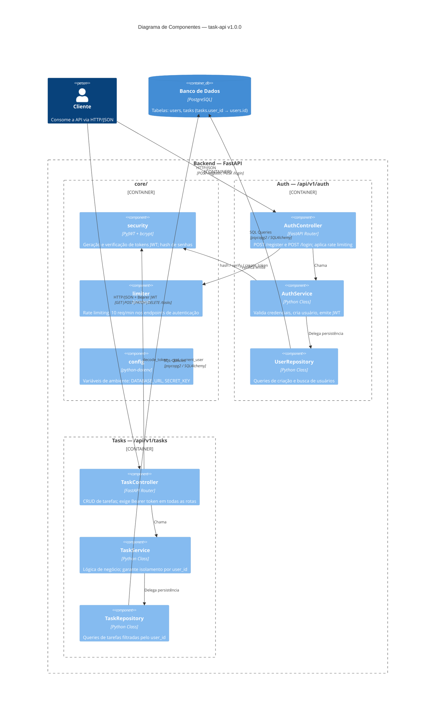

```mermaid
C4Component
    title Diagrama de Componentes — task-api v1.0.0

    Person(client, "Cliente", "Consome a API via HTTP/JSON")

    Container_Boundary(backend, "Backend — FastAPI") {

        Container_Boundary(core, "core/") {
            Component(security, "security", "PyJWT + bcrypt", "Geração e verificação de tokens JWT; hash de senhas")
            Component(limiter, "limiter", "slowapi", "Rate limiting: 10 req/min nos endpoints de autenticação")
            Component(config, "config", "python-dotenv", "Variáveis de ambiente: DATABASE_URL, SECRET_KEY")
        }

        Container_Boundary(auth_layer, "Auth — /api/v1/auth") {
            Component(auth_ctrl, "AuthController", "FastAPI Router", "POST /register e POST /login; aplica rate limiting")
            Component(auth_svc, "AuthService", "Python Class", "Valida credenciais, cria usuário, emite JWT")
            Component(user_repo, "UserRepository", "Python Class", "Queries de criação e busca de usuários")
        }

        Container_Boundary(task_layer, "Tasks — /api/v1/tasks") {
            Component(task_ctrl, "TaskController", "FastAPI Router", "CRUD de tarefas; exige Bearer token em todas as rotas")
            Component(task_svc, "TaskService", "Python Class", "Lógica de negócio; garante isolamento por user_id")
            Component(task_repo, "TaskRepository", "Python Class", "Queries de tarefas filtradas pelo user_id")
        }
    }

    ContainerDb(db, "Banco de Dados", "PostgreSQL", "Tabelas: users, tasks (tasks.user_id → users.id)")

    Rel(client, auth_ctrl, "HTTP/JSON", "POST /register, POST /login")
    Rel(client, task_ctrl, "HTTP/JSON + Bearer JWT", "GET|POST|PATCH|DELETE /tasks")

    Rel(auth_ctrl, limiter, "Verifica limite")
    Rel(auth_ctrl, auth_svc, "Chama")
    Rel(auth_svc, security, "hash / verify / create_token")
    Rel(auth_svc, user_repo, "Delega persistência")
    Rel(user_repo, db, "SQL Queries", "psycopg2 / SQLAlchemy")

    Rel(task_ctrl, security, "decode_token → get_current_user")
    Rel(task_ctrl, task_svc, "Chama")
    Rel(task_svc, task_repo, "Delega persistência")
    Rel(task_repo, db, "SQL Queries", "psycopg2 / SQLAlchemy")
```
